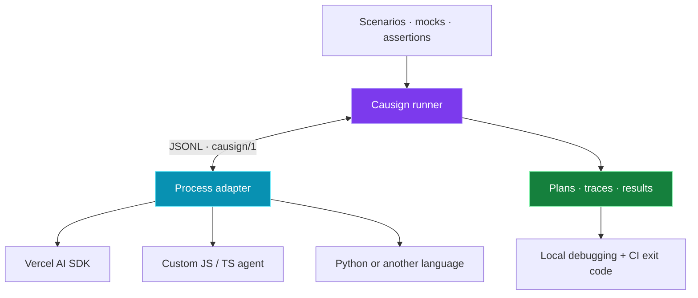
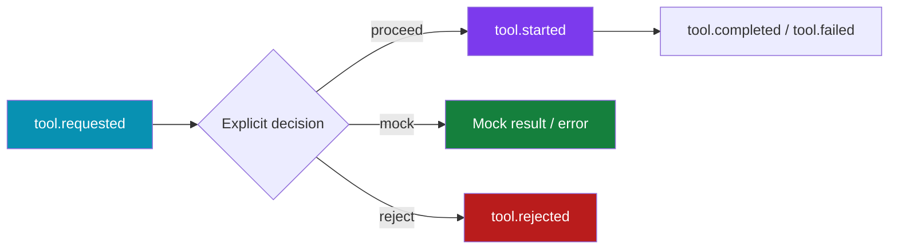

<p align="center"></p>
<p align="center">
<a href="https://github.com/sebamar88/Causign/actions/workflows/ci.yml"></a>


</p>
<p align="center"><strong>Test what your agent requests. Verify what it executes. Keep the evidence.</strong></p>
<p align="center"><a href="docs/getting-started.md">Get started</a> · <a href="docs/scenarios.md">Write scenarios</a> · <a href="docs/adapters.md">Connect an agent</a> · <a href="docs/ci.md">Run in CI</a> · <a href="docs/README.md">Documentation</a></p>

## Meet Causign

Your agent can give the right answer and still call the wrong tool, skip an
approval, or trigger an unwanted effect. Testing only its final text misses
that behavior. Reading logs manually makes regressions harder to repeat and
harder to enforce in CI.

Causign turns those expectations into repeatable tests. It runs your instrumented
agent, controls selected tool calls, checks what happened, and saves the evidence.
You get a test result your CI can act on and a trace you can use to explain it.

## Why use it?

| When this happens…                                                      | Causign helps you…                                                        | What you gain                                                                |
| ----------------------------------------------------------------------- | ------------------------------------------------------------------------- | ---------------------------------------------------------------------------- |
| A prompt, model or tool change alters behavior                          | Rerun the same scenarios and assertions                                   | A regression check before shipping                                           |
| A test would execute a payment, deployment or external lookup           | Replace selected instrumented tools with static results/errors            | Test the surrounding agent flow without invoking those real implementations  |
| The answer looks correct, but the agent attempted a forbidden operation | Assert tool requests, real execution, rejections and approvals separately | Visibility into actions that final-text checks miss                          |
| A failing run leaves you guessing what happened                         | Retain assertion reasons and references to trace events                   | Evidence you can inspect instead of reconstructing a run from scattered logs |
| Teams use different languages or frameworks                             | Connect them through the same JSONL contract                              | A shared runner, result model and CI workflow                                |
| Your CI only knows whether the process exited                           | Return distinct behavior, infrastructure and compatibility outcomes       | Failures that point to the kind of problem you need to fix                   |

You provide your scenarios and an instrumented adapter. Causign provides process
management, capability checks, static tool interception, assertions, evidence
artifacts and CI exit codes. You do not have to build that plumbing again for
each agent. It does not automatically discover every risk or make live models
deterministic.

## How it fits your existing tests

**Development preview:** [agent discovery and open plugins](docs/agent-discovery.md)
add explicit source scanning and independent execution adapters for custom
frameworks. Claude has a restricted output profile; Codex discovery is available
with execution blocked pending verified tool denial. This feature is not in the
published CLI 0.1.0.

These approaches solve different parts of the problem; Causign can sit alongside
your unit tests and output evaluations.

| Approach                                  | Useful for                                  | What Causign adds                                                                                  |
| ----------------------------------------- | ------------------------------------------- | -------------------------------------------------------------------------------------------------- |
| Unit tests for individual tools/functions | Checking isolated implementation logic      | Scenarios around the instrumented agent's actual tool-selection and approval flow                  |
| Assertions on the final answer            | Checking expected content and quality       | Evidence of intent, execution, mocks and rejections, even when the answer looks fine               |
| Ad hoc scripts and manual logs            | Exploring or debugging a particular run     | A reusable scenario format, lifecycle validation, standardized artifacts and CI status semantics   |
| A custom framework-specific harness       | Deep integration with one application stack | A common protocol and runner across adapters; framework-specific instrumentation is still required |

**Use Causign when** you need to verify observable agent behavior across runs,
especially tool calls, approvals and regressions in CI. For a pure function with
no agent interaction, an ordinary unit test is usually enough. For production
monitoring or security isolation, use dedicated systems alongside Causign.

## What can you test?

### Understand failures visually

The development build adds a [local report viewer](docs/local-reports.md). Open
completed runs with `causign report`, or run tests with `causign run --open`.
Compare expected and observed JSON, read the recorded failure reason, and jump
to the trace event behind an assertion. History, status filters, and lifecycle
evidence help you investigate a failure without reading raw artifact files.
This feature is not yet included in npm `0.1.0`.


| 🧪 Tests                             | 📊 Evals                                            | 🛡️ Security                                             |
| ------------------------------------ | --------------------------------------------------- | ------------------------------------------------------- |
| Scenarios, fixtures and static mocks | Output checks and semantic evaluators               | Tool intent, execution, rejection and approval evidence |
| Deterministic local examples         | Regression scenarios, latency and explicit USD cost | Interception that fails closed                          |

**MVP scope:** a CLI, declarative SDK, language-neutral protocol and Vercel AI SDK adapter. Model-diff dashboards, model interception and security sandboxing are outside this release. The five packages are published on npm at version `0.1.0`.

## One runner. Multiple adapters.



Adapters declare capabilities. Unsupported requirements produce `INCOMPATIBLE` before execution. JS/TS can use the SDK bridge; other languages can implement the JSONL protocol without an SDK.

## Try it locally

### Run without adding a project dependency

From a new directory, use Node **22+** and one of these executors:

```sh
npx --yes @causign/cli@0.1.0 init
npx --yes @causign/cli@0.1.0 inspect
npx --yes @causign/cli@0.1.0 run
```

| Executor | Equivalent command (replace `init` with `inspect` or `run`) |
| -------- | ----------------------------------------------------------- |
| pnpm dlx | `pnpm dlx @causign/cli@0.1.0 init`                          |
| pnpx     | `pnpx @causign/cli@0.1.0 init`                              |

These executors download/cache the CLI without adding it to project dependencies.
The starter requires no local SDK. Scenarios that import `@causign/sdk` need that
package installed in their project. pnpm may prompt for dependency-build decisions; enabling esbuild's postinstall
is not an intrinsic requirement of Causign.

### Install in a project

Use Node **22+**. In a new project:

```sh
pnpm init
pnpm add -D @causign/cli@0.1.0 @causign/sdk@0.1.0
pnpm exec causign init
pnpm exec causign inspect
pnpm exec causign run
```

If pnpm blocks pending esbuild scripts, merge this explicit rejection into your
project's `pnpm-workspace.yaml`, run `pnpm install`, and retry:

```yaml
allowBuilds:
  esbuild: false
```

Causign uses esbuild through tsx to load TypeScript, but its postinstall need not
run when the platform binary dependency is installed. A clean Windows consumer
with pnpm 12.8.1 passed the starter with this policy and an empty package store.

Expected result: **PASS sample-greeting**, exit code **0**, and plan, trace and
results files under `.causign/results`. The starter is local and needs no model
credentials. `init` refuses existing target files; reuse `inspect` and `run` on
subsequent executions.

See [getting started](docs/getting-started.md) for agent configuration, source
builds and local tarball installation. Python is needed only when your agent or
repository cross-language tests use it.

## Tests that describe intent

```ts
import { agentTest, expect } from "@causign/sdk";

export default agentTest("refund requires approval", {
  agent: "support",
  input: { customerId: "fake" },
  mocks: { "customer.lookup": { result: { name: "Ada" } } },
  approvalDecisions: [{ decision: "reject" }],
  assertions: [
    expect.tool("customer.lookup").toHaveBeenMocked(),
    expect.approval().toHaveBeenRejected(),
    expect.tool("refund").not.toHaveBeenExecuted(),
  ],
});
```

Save as `refund.causign.ts` and configure an instrumented `support` agent. This follows the [support fixture](examples/support/scenario.mjs). Mocking and business approval are separate decisions.

## Requested ≠ executed



A request records intent; `tool.started` records real execution. A mock never proves real execution. Absence in an incomplete trace cannot prove a tool was safe. Interception timeouts never authorize execution. [Read the evidence model](docs/results-and-security.md).

## Built for CI

| Result       | Exit | Meaning                                       |
| ------------ | ---: | --------------------------------------------- |
| PASS / SKIP  |    0 | Passed assertions or explicit skip            |
| FAIL         |    1 | Unexpected behavior                           |
| ERROR        |    2 | Infrastructure, protocol or evaluator problem |
| INCOMPATIBLE |    3 | Required capability or protocol unavailable   |
| Interrupted  |  130 | Explicit user interruption                    |

The [acceptance workflow](.github/workflows/ci.yml) runs the same checks on **Linux x64 · Windows x64 · macOS ARM64 · Linux ARM64**, including coverage and seven installed-CLI scenarios. The badge shows the current remote status. Reports retain evidence under `.causign/results` by default.

## Explore the examples

| Fixture                             | Focus                                             |
| ----------------------------------- | ------------------------------------------------- |
| [Support](examples/support)         | Customer lookup mock and rejected refund approval |
| [Coding](examples/coding)           | Instrumented coding-tool behavior                 |
| [DevOps](examples/devops)           | Operational tool and approval assertions          |
| [RAG](examples/rag)                 | Citation evaluator                                |
| [Coordinator](examples/coordinator) | Instrumented coordinator scenario                 |
| [Python](fixtures/python-agent.py)  | Standard-library JSONL interoperability           |
| [Vercel](examples/vercel)           | Real AI SDK with a deterministic mock model       |

These fixtures use fake/local tools. Their `.mjs` exports need `*.causign.ts` wrappers for CLI discovery; see [the examples guide](examples/README.md).

## Packages and assistant skill

| Package                   | Responsibility                                  |
| ------------------------- | ----------------------------------------------- |
| `@causign/protocol`       | Schemas, types and lifecycle validation         |
| `@causign/core`           | Negotiation, processes, assertions and evidence |
| `@causign/sdk`            | Declarative scenarios and JS/TS bridge          |
| `@causign/cli`            | `init`, `inspect`, `run` and reports            |
| `@causign/adapter-vercel` | Adapter for exactly `ai@7.0.127`                |

The [Causign skill](skills/causign/SKILL.md) guides coding assistants through setup and evidence interpretation. Install `skills/causign` with your runtime's skill installer, then invoke `$causign`. The CLI executes tests; the skill guides its use.

## Documentation

- [Documentation map](docs/README.md)
- [Getting started](docs/getting-started.md)
- [Scenarios, assertions and evaluators](docs/scenarios.md)
- [Adapters](docs/adapters.md)
- [Results and security boundaries](docs/results-and-security.md)
- [GitHub Actions](docs/ci.md)
- [Development and distribution](docs/development.md)
- [Protocol v1](docs/protocol-v1.md) and [adapter conformance](docs/adapter-conformance.md)

Process isolation is not a security sandbox. Instrumentation must observe intent before effects; an untrusted adapter can conceal activity. Live models remain nondeterministic. Cost assertions need a final explicit USD amount; tokens alone imply neither pricing nor statistical confidence.
