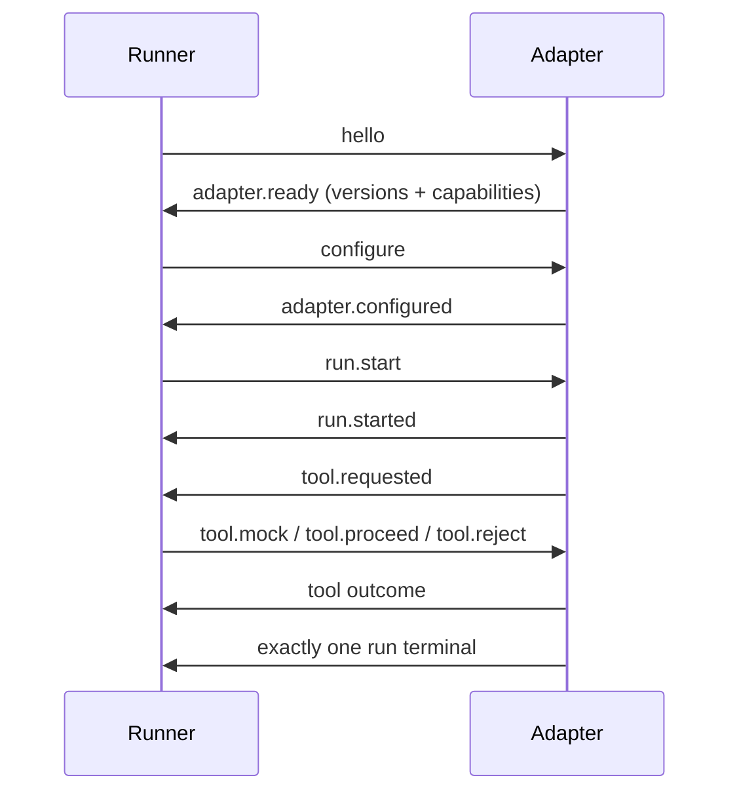

# Connecting an agent

## JS/TS bridge

```js
// support-agent.mjs
import { serveAgent } from "@causign/sdk";

await serveAgent(async (input, context) => {
  return context.callTool("lookup", input, async () => ({
    customer: "Local fixture",
  }));
});
```

Configure Node to run this file and use [the lookup scenario](scenarios.md).
The static mock replaces the implementation. Put side effects inside the
implementation, not before `callTool`; use `context.signal` for cooperative
cancellation. stdout is protocol only; diagnostic logs belong on stderr.

The bridge provides output, tool evidence, interception, approval observation/
control and cancellation for custom handlers. Message, model-call and usage
observation require explicit opt-in and truthful instrumentation. Consult SDK
`AgentContext`/`BridgeOptions` types rather than inventing event APIs.

## Vercel AI SDK

```ts
import { serveAgent } from "@causign/sdk";
import {
  createVercelAdapter,
  vercelBridgeOptions,
} from "@causign/adapter-vercel";

await serveAgent(
  createVercelAdapter({
    model,
    tools,
    instructions: "Help the user",
    maxSteps: 20,
  }),
  vercelBridgeOptions,
);
```

`model` and `tools` belong to your application. Compatibility is exactly
`ai@7.0.127`. Input accepts either `{ prompt: 'hello' }` or nonempty user/assistant
text `messages`. Output is `{ text: string }`. Always use `vercelBridgeOptions`.

| Supported                                                | Outside this adapter's MVP      |
| -------------------------------------------------------- | ------------------------------- |
| Output, messages, actual provider calls, available usage | Cost estimation                 |
| Local tool request/execution/result/rejection evidence   | Native approvals                |
| Tool interception and cooperative cancellation           | Streaming or model interception |

Tools need local execute functions and JSON values. Provider/declaration-only
tools, `needsApproval`, async generators and async iterable results are
unsupported. Cancellation cannot stop functions that ignore the signal.
Read [the full compatibility reference](../packages/adapter-vercel/README.md).

## Other languages

An adapter consumes UTF-8 JSONL on stdin and emits one object per stdout line.
No JS SDK is required. stderr is diagnostics.



Start from [the Python standard-library fixture](../fixtures/python-agent.py),
then implement [protocol v1](protocol-v1.md) and run [conformance checks](adapter-conformance.md).
The fixture is an interoperability example, not a general production adapter.
Message IDs are unique; operation IDs are scoped to run. Correlations reference
the triggering message. No explicit decision means no intercepted execution,
including on timeout/disconnect. One process runs per scenario; framework names
never imply capability support.
