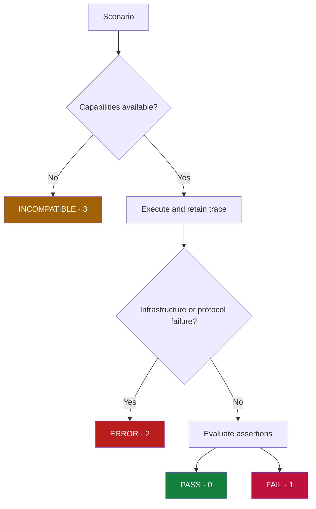

# Results, evidence and security

## Artifacts

`run --verbose` prints expected/observed values, reasons and evidence references,
plus bounded diagnostics. Each suite receives a unique results directory beneath
`.causign/results` by default.

| Artifact       | Contents                                                                      |
| -------------- | ----------------------------------------------------------------------------- |
| `results.json` | Version, results, diagnostics, exit code and artifact manifest                |
| Plan files     | `{ schemaVersion: '1', plan: RunPlan }`                                       |
| Trace files    | Protocol facts, coverage, receive order, completeness and terminal provenance |

Use manifest paths rather than deriving filenames from scenario IDs. Plans are
decisions; traces are facts; assertions are claims with message/operation, metric
or evaluator evidence. Inputs/outputs and diagnostics may contain sensitive data;
choose artifact visibility and retention appropriate to your project.

## Status semantics

Scenario statuses are PASS, FAIL, ERROR, INCOMPATIBLE and SKIP. Assertions use
PASS, FAIL, ERROR and NOT_EVALUATED. Suite severity is ERROR (2) > INCOMPATIBLE
(3) > FAIL (1) > PASS/SKIP (0). Explicit user interruption returns 130; empty
suites are ERROR. A completed run can fail assertions. Domain failure is FAIL;
protocol, transport or evaluator failure is ERROR. Detected missing capabilities
before execution start no run.

## Negative security claims

| Evidence                                        | `not.toHaveBeenExecuted()`         |
| ----------------------------------------------- | ---------------------------------- |
| Matching real `tool.started`                    | FAIL, even in an incomplete trace  |
| Absent, complete trace and required observation | PASS                               |
| Absent, incomplete trace                        | NOT_EVALUATED; no proof of absence |
| Missing required capability before execution    | Scenario INCOMPATIBLE              |

Mock success does not prove real execution; real failure proves execution began.
Inspect rejection provenance rather than treating every rejection as a runner
security block. Fail-closed interception requires exactly one valid explicit
decision. Timeouts, invalid replies, disconnect and cancellation never grant it.

## Boundaries

Process isolation is not a filesystem/network/credential sandbox. Effects outside
instrumentation are outside observed evidence; untrusted adapters may conceal
activity. Adversarial prompt scenarios can test exposed effects, but passing them
is not universal security certification. An automatic injection attack catalogue
is outside this MVP. Live model behavior remains nondeterministic.

## Troubleshooting

| Symptom                | Inspect                                                                |
| ---------------------- | ---------------------------------------------------------------------- |
| INCOMPATIBLE           | Missing capabilities; truthful adapter support or supported assertions |
| Invalid JSONL          | stdout logs, malformed frames, versions and frame limits               |
| Handshake timeout      | Command, args, cwd and stderr                                          |
| Interception timeout   | Pending operation/decision; never bypass authorization                 |
| Approval unresolved    | Explicit decisions and adapter approval support                        |
| Evaluator ERROR        | Factory export, module path and verdict shape                          |
| Artifact write failure | Permissions/path; results stay ERROR                                   |
| Python missing         | Executable or absolute `CAUSIGN_PYTHON`                                |
| Generated types stale  | `pnpm generate`; inspect real contract drift (LF/CRLF accepted)        |

Transport defaults: 10s handshake, 30s scenario, 5s interception, 1 MiB frame,
64 KiB retained stderr, 32 MiB trace and 100,000 messages. Core `RunOptions.limits`
supports overrides; these are not extra CLI flags. Truncation or runner-generated
error terminals mark evidence incomplete. [Protocol v1](protocol-v1.md) defines
the precise semantics.
